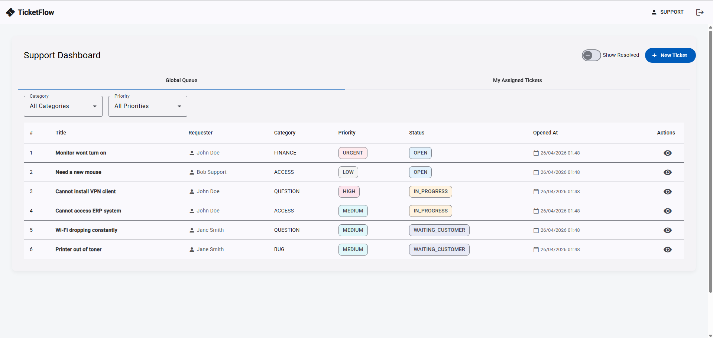
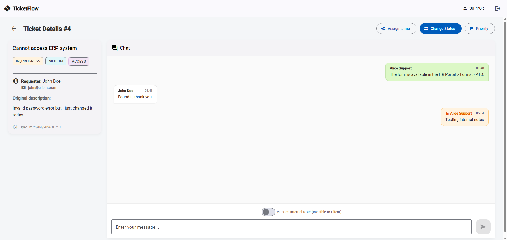
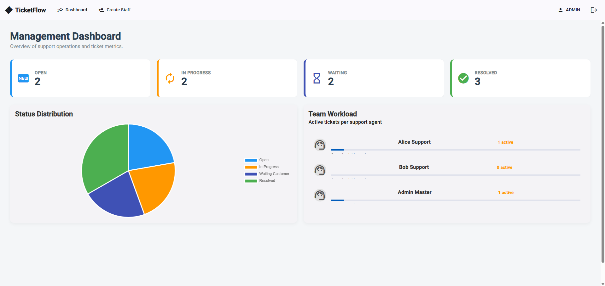

# 🖥️ TicketFlow Web Interface


O **TicketFlow Web** é a interface de gestão centralizada do ecossistema TicketFlow. Desenvolvida com as funcionalidades mais recentes do Angular, a aplicação oferece uma experiência de Single Page Application (SPA) performática, segura e totalmente responsiva para a gestão de chamados técnicos.

🔗 **Link de Produção:** [https://ticketflow-web.netlify.app](https://ticketflow-web.netlify.app)

---

## 🚀 Funcionalidades Principais

### 🔒 Segurança e Acesso

- **RBAC (Role-Based Access Control):** Interfaces dinâmicas que se adaptam aos perfis `CLIENT`, `SUPPORT` e `ADMIN`.
- **Proteção de Rotas:** Uso de `AuthGuard` e `RoleGuard` para garantir que usuários acessem apenas o que lhes é permitido.
- **Autenticação Stateless:** Integração com JWT (JSON Web Token) com persistência segura e injeção automática via `HttpInterceptor`.

### 🎫 Gestão de Chamados

- **Dashboard de Tickets:** Listagem paginada com filtros inteligentes.
- **Ciclo de Vida Completo:** Abertura de chamados, atribuição de técnicos, alteração de prioridade (`LOW` a `URGENT`) e atualização de status em tempo real.
- **Interação em Chat:** Sistema de mensagens integrado para comunicação direta entre cliente e suporte, incluindo **Notas Internas** visíveis apenas para a equipe técnica.

### 👑 Administração (Staff Management)

- **Painel de Controle:** Dashboard administrativo com métricas de performance da equipe.
- **Gestão de Equipe:** Interface exclusiva para administradores criarem novas contas de suporte e gestão.

---

## 🛠️ Stack Tecnológica

- **Framework:** [Angular 19](https://angular.dev/) (utilizando a nova sintaxe de @if/@for e Signals para reatividade).
- **Gestão de Estado:** Signals e RxJS para fluxos de dados assíncronos.
- **Componentização:** Arquitetura baseada em componentes reutilizáveis e standalone.
- **Estilização:** SCSS modularizado e uso de bibliotecas de utilitários como `tailwind-merge` e `clsx` para manipulação dinâmica de classes.
- **Feedback Visual:** [SweetAlert2](https://sweetalert2.github.io/) para notificações e alertas interativos.
- **Ícones:** [Lucide Angular](https://lucide.dev/).

---

## 📂 Estrutura do Projeto

A arquitetura segue as melhores práticas de escalabilidade do Angular:

```text
src/app/
 ┣ 📂 core/          # Singleton services, guards, interceptors e layout principal.
 ┃ ┣ 📂 guards/      # Proteção de rotas (Auth/Role).
 ┃ ┣ 📂 interceptors/# Injeção de JWT nas requisições.
 ┃ ┣ 📂 layout/      # Estrutura base da aplicação (Navbar, Sidebar).
 ┃ ┗ 📂 services/    # Serviços globais (AuthService, TicketService).
 ┣ 📂 features/      # Módulos de funcionalidade (Lazy Loaded).
 ┃ ┣ 📂 admin/       # Dashboard e criação de staff.
 ┃ ┣ 📂 auth/        # Login e Registro.
 ┃ ┗ 📂 tickets/     # Listagem, criação e detalhes de chamados.
 ┣ 📂 shared/        # Pipes, diretivas e componentes reutilizáveis.
 ┗ 📜 app.routes.ts  # Definição centralizada de rotagem.
```

---

## 📸 Demonstração

Esta seção apresenta a interface visual do TicketFlow. Para uma experiência completa, recomenda-se acessar o [Link de Produção](https://ticketflow-web.netlify.app).

<div align="center">
  <h3>Tela principal</h3>
  <p align="center">
    
  </p>
  <br>
  <table width="100%">
    <tr>
      <td width="50%" align="center">
        <b>Detalhamento de Chamado</b><br>
        
      </td>
      <td width="50%" align="center">
        <b>Dashboard do admin</b><br>
        
      </td>
    </tr>
  </table>
</div>

---

## ⚙️ Configuração e Instalação

Siga os passos abaixo para configurar o ambiente de desenvolvimento local.

### 📋 Pré-requisitos

- **Node.js:** v18.0.0 ou superior.
- **Gerenciador de Pacotes:** npm ou yarn.
- **Angular CLI:** v19.0.0 ou superior (`npm install -g @angular/cli`).

### 🛠️ Instalação Passo a Passo

1.  **Clone o repositório:**

    ```bash
    git clone [https://github.com/RuanPablo2/TicketFlow-Web.git](https://github.com/RuanPablo2/TicketFlow-Web.git)
    cd TicketFlow-Web
    ```

2.  **Instale as dependências:**

    ```bash
    npm install
    ```

3.  **Configure o Ambiente:**
    O projeto utiliza arquivos de environment para gerenciar a URL da API. Altere o arquivo `src/environments/environment.ts` para apontar para o seu API Gateway local:

    ```typescript
    export const environment = {
      production: false,
      apiUrl: "http://localhost:8081/api",
    };
    ```

4.  **Execute o Servidor de Desenvolvimento:**
    ```bash
    ng serve
    ```
    Após o build, a aplicação estará disponível em `http://localhost:4200`.

---

## 🌐 Deploy (Netlify)

O deploy deste Front-end é gerenciado de forma contínua pelo **Netlify**. Toda alteração na branch `main` dispara um novo build automático.

### 🔄 Tratamento de Rotas SPA

Como o Angular é uma Single Page Application (SPA), configuramos uma regra de redirecionamento para evitar erros 404 ao atualizar páginas internas. O arquivo `public/_redirects` contém:

```text
/* /index.html  200
```

---

## 👨‍💻 Autor

Desenvolvido por Ruan Pablo (https://github.com/RuanPablo2). Feedbacks e contribuições são bem-vindos!
